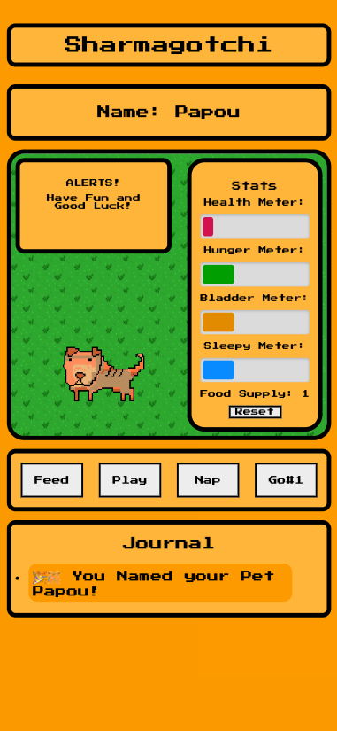

## 
Welcome to Sharmagotchi!

## 
Your new favorite pet simulator! <a href="https://sharmagotchi.netlify.app/">Link</a> to game.

 

<a href="https://clarkdoom.notion.site/544c77fb7fb04deb8fef22c70dc97162?v=d00b19eecb274b359cd87b4def2129b6">Link</a> to Planning Materials  

This is an app inspired by my two charming but very needy Shar Pei. Owning a pet is hard work but its also fun and rewarding, which inspired me to model what it sometimes feels like with my app. Its a constant fight against the clock to make sure they're fed, well rested, taken out, and have got enough play time.   

## 
Getting Started 

Mobile

Desktop
 

## Goal of the Game: Raise your own digital pet and ensure they are happy and healthy. 
  
  - Enter a name for your newly adopted Sharmagotchi to begin the game.
  - Raise your pet's health meter to full by interacting with them.
  - Play with your pet to increase their food supply.
  - Don't let your pet's hunger, bladder, or sleepy meter get too full or their health meter will go down.
  - If your health meter reaches 0, your pet will play dead, pass out from exhaustion, or be too sad to continue being your pet and you must reset the game.

## Features: 
* True to life mechanics such as eating, sleeping, going # 1, and playing.
* Game alerts that catch your attention.
* Pet Care Journal to display a history of your interactions.
* responsive design that works on mobile and desktop (see pics above)

## Technology used

* Javascript
* html
* CSS

## Future Enhancements 

- Multi-tier health bar that increases as your pet's age increases
- Additional pet options with accompanying animations
- Dark Mode

## Atributions: 
* All animations were created by myself using <a href="https://www.pixilart.com/">pixilart</a>. 
* Sounds provided by <a href="https://pixabay.com/">Pixabay</a> under an open license that allows for free personal or commercial use. 
* <a href="https://www.freepik.com/free-photo/yellow-clay-textured-background-colorful-handmade-creative-art-abstract-style_18096858.htm#query=mustard%20yellow%20background&position=41&from_view=keyword">Background Image by rawpixel.com</a> on Freepik